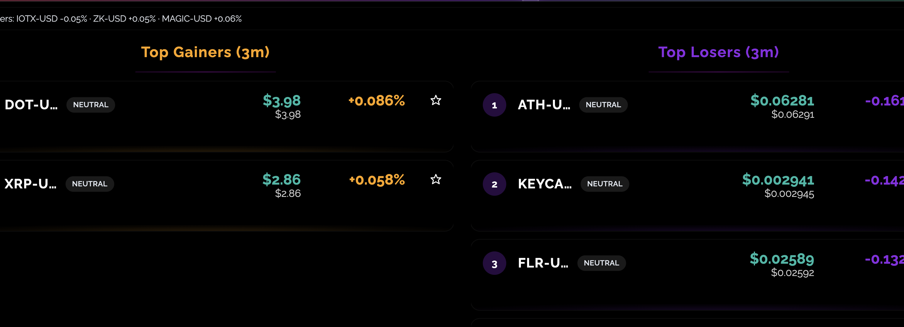
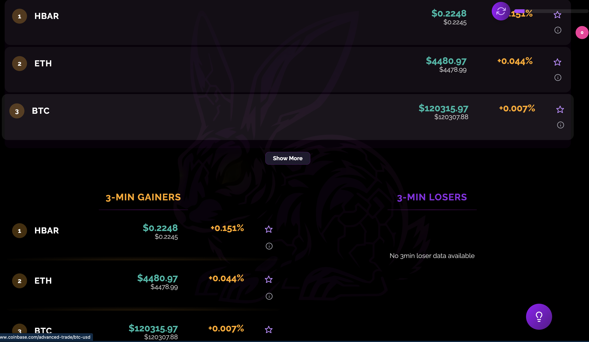
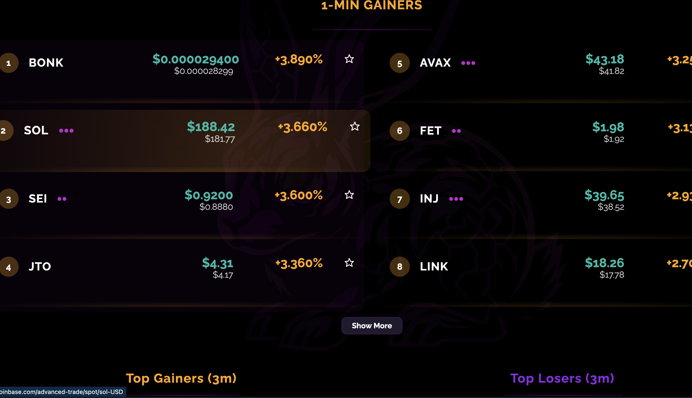

# BHABIT Dashboard – Canonical UI, Data, and Implementation Paths

This document is the source of truth for the **BHABIT CB dashboard**.

If you are changing the UI, wiring new data, or asking an AI to help,  
you must follow this document. Do **not** reintroduce the legacy
"BHABIT Crypto Dashboard / Alerts 25 NEW" header or layout.

---

## 0. Canonical Layout (what the screen *must* look like)

Visually, the dashboard follows the reference screenshots from **Sept 2–3, 2025**.

**Top band**

- Left: timestamp pill  
  `Latest: {TIME} on {DATE}`
- Right: LIVE indicator + refresh slider/button
- No legacy "BHABIT Crypto Dashboard" header; this is gone.

**Hero band**

- Centered BHABIT wordmark + subtitle  
  `BHABIT`  
  `Profits Buy Impulse`
- Giant ghost rabbit watermark behind content (dark, low opacity).

**Data rails (THIS ORDER MATTERS)**

1. **Row 1 – 1-MIN GAINERS hero (full width)**  
   - Header: `1-MIN GAINERS` in gold.
   - Panel uses the full width of the content rail.
   - **Initial display: 8 rows maximum (4 per column)**
     - 0–4 tokens: Single column (left), panel still full-width
     - 5–8 tokens: Two columns, left (ranks 1–4) + right (ranks 5–8)
     - 9+ tokens: Shows 8 visible (4+4), displays "Show More" button
   - **Expanded state: 16 rows maximum (8 per column)**
     - Left column: up to 8 rows
     - Right column: up to 8 rows
     - "Show Less" button to collapse back to 8
   - Each row:  
     - Rank circle (gold border)  
     - Symbol (white)  
     - Current price (cyan/teal)  
     - Previous price (small amber subline)  
     - 1-minute % change (gold)  
     - Star (watchlist), Info (opens sentiment/insights) - stacked vertically

2. **Row 2 – 3-MIN PANELS (side-by-side)**

   - **Left column:** `3-MIN GAINERS`  
     - Same visuals as 1-minute, but 3-minute data.

   - **Right column:** `3-MIN LOSERS`  
     - Same layout but header and % in purple.  
    # BHABIT Dashboard – Canonical UI, Data, and Implementation Paths

    This document is the **single source of truth** for the BHABIT CB home dashboard.

    If you are changing the UI, wiring new data, or asking an AI to help,  
    you must follow this document. Do **not** reintroduce the legacy  
    “BHABIT Crypto Dashboard / Alerts 25 NEW” header or layout.

    ---

    ## 0. Canonical Layout (what the screen *must* look like)

    Visually, the dashboard matches the Sept 2–3, 2025 reference screenshots.

    ### Top band

    - Left: timestamp pill  
      `Latest: {TIME} on {DATE}`
    - Right: `LIVE` indicator + refresh button/slider.
    - No old “BHABIT Crypto Dashboard / Alerts 25 NEW” header.

    ### Hero band

    - Centered BHABIT wordmark + subtitle:
      - `BHABIT`
      - `Profits Buy Impulse`
    - Giant ghost rabbit watermark behind content (dark, low opacity).

    ### Data rails (THIS ORDER MATTERS)

    1. **Row 1 – 1-MIN GAINERS hero (full width)**  

       - Header: `1-MIN GAINERS` in gold.
       - Panel uses the **full width** of the content rail.
       - Behavior:

       **Initial state (collapsed) – 8 rows max**

       - `0–4` tokens: single column (left), panel still full-width.
       - `5–8` tokens: two columns — left (ranks 1–4) + right (ranks 5–8).
       - `9+` tokens: still shows **8 visible** (4+4) with a **“Show More”** button.

       **Expanded state – 16 rows max**

       - “Show More” expands to **16 rows**:
         - Left column: up to 8 rows.
         - Right column: up to 8 rows.
       - “Show Less” collapses back to 8 rows.

       **Each 1m row shows:**

       - Rank circle (gold border).
       - Symbol (white, suffix stripped; e.g., `BTC-USD` → `BTC`).
       - Current price (cyan/teal).
       - Previous price baseline (small amber subline).
       - 1-minute % change (gold).
       - Stacked actions:
         - Star (watchlist toggle).
         - Info (opens Insights/Sentiment panel).

    2. **Row 2 – 3-MIN PANELS (side-by-side)**

       - **Left column:** `3-MIN GAINERS`  
         - Same visuals as the 1m table, but 3-minute data.
         - Single vertical list with “Show More” up to 16 rows.

       - **Right column:** `3-MIN LOSERS`  
         - Same layout.
         - Header and % change text in purple.
         - If no 3m losers present:
           - Show `No 3-min loser data available`.

       - **Under 3-MIN LOSERS, in the same right column:** `WATCHLIST` panel.  
         - Pill-style rows.
         - Shows:
           - Symbol
           - Current price
           - % change since added to watchlist (baseline → current).

    ### Hover / aura styling

    - Rows sit on a dark transparent canvas, **no heavy card borders**.
    - Hover state:
      - A thin horizontal gradient line under the row (orange / cyan / pink).
      - Subtle row glow, not a big block highlight.
    - The September “thin aura + tight hover line” style is canonical.

    ---

    ## 1. UX / Visual Rules

    1. **Rabbit brightness**
       - Default: very faint (`opacity ~0.06–0.08`).
       - Lights up (higher opacity + glow) when:
         - `/data` refresh completes, **and/or**
         - A row is hovered.
       - Glow fades back after ~250–300 ms.
       - Implementation: the root app toggles a `bh-rabbit-bg is-lit` class.

    2. **Row focus**
       - `.token-row:focus-within` shows a visible but subtle focus outline or aura.
       - Keyboard users tabbing through star/info must clearly see the focused row.

    3. **Percent formatting**
       - Backend returns **percent values** (e.g., `2.53` means `2.53%`).
       - Rules:
         - `abs(change) < 1` → 3 decimals (e.g., `+0.153%`)
         - `abs(change) >= 1` → 2 decimals (e.g., `+2.46%`)
       - Always include a sign (`+` or `-`).
       - Avoid showing `+0.000%` rows unnecessarily.

    4. **Click targets**
       - Either of these must open Insights for that token:
         - Clicking the **% cell**, or
         - Clicking the **info button**.
       - Info button stays for clarity and accessibility.

    5. **Empty-state text**
       - 1m gainer panel with no data:
         - `Waiting for 1-minute snapshot…`
       - 3m losers with no data:
         - `No 3-min loser data available`
       - Watchlist empty:
         - `Star or add a token to pin it here.`

    ---

    ## 2. Layout / Responsiveness Rules

    ### Base layout (desktop)

    - `.bh-main`:
      - `display: grid;`
      - `grid-template-columns: 390px 390px;`
      - `column-gap: 190px;` **(space for the rabbit)**
    - Left column:
      - 1m hero panel → 3m gainers panel.
    - Right column:
      - 3m losers panel → Watchlist panel.

    ### Responsive collapse

    ```css
    @media (max-width: 1180px) {
      .bh-main {
        display: flex;
        flex-direction: column;
        gap: 18px;
        padding: 18px;
      }

      .one-min-grid {
        grid-template-columns: 1fr;
      }

      .bh-rabbit-bg {
        opacity: 0.04;
        background-size: 420px auto;
      }

      /* Watchlist goes to the bottom on small screens */
      .bh-watchlist {
        order: 100;
      }
    }
    ```

    For AI / copilot behavior and branch rules, see `docs/ai/AI_INDEX.md` – "Branch & Ownership Rules for AI / Copilot".


    Rabbit background

    Minimum rules:
    	•	Fixed behind content, horizontally centered.
    	•	Very low opacity by default; brighter when is-lit is present.
    	•	Uses filter: drop-shadow(...) for the faint aura.
    	•	Optional CSS variable for image source:

    :root {
      --bh-rabbit-img: url("/rabbit.png");
    }

    .bh-rabbit-bg {
      background-image: var(--bh-rabbit-img);
    }


    ⸻

    3. Data / Modeling Rules

    /data response – current contract

    From the frontend’s perspective, useData() sees:

    {
      "gainers_1m": [ /* 1m gainer rows */ ],
      "gainers_3m": [ /* 3m gainer rows */ ],
      "losers_3m":  [ /* 3m loser rows  */ ]
    }

    (If the backend wraps this in an envelope like { "data": { ... } },
    useData() unwraps it so the rest of the UI still sees the shape above.)

    Each row includes (core contract):
    	•	symbol (e.g., "BTC-USD")
    	•	current_price (number)
    	•	initial_price_1min / initial_price_3min (numbers)
    	•	price_change_percentage_1min / price_change_percentage_3min (numbers, already in %)
    	•	Optional rank field (not required; UI can derive rank from index).

    Normalization rules
    	•	When displaying symbols, strip common suffixes:
    	•	-USD, -USDT, -PERP
    	•	Do not strip on the canonical key:
    	•	bySymbol map and watchlist keys use the full symbol (e.g., BTC-USD).
    	•	Prefer to normalize once in the data layer (hook) to a displaySymbol field
    instead of doing .replace(...) in every component.

    Watchlist model

    Watchlist items are stored as:

    {
      symbol:  string,       // e.g. "BTC-USD"
      baseline: number|null, // price when added to watchlist
      current:  number|null  // latest /data price
    }

    	•	Baseline is set at the moment the item is added.
    	•	On each /data refresh, the app:
    	•	Builds a bySymbol map from the union of all movers arrays.
    	•	Calls refreshFromData(bySymbol) inside WatchlistContext.
    	•	For any watchlist item with a matching bySymbol[symbol], current is updated.

    Delta % is computed in the frontend:

    deltaPct = baseline && current
      ? ((current - baseline) / baseline) * 100
      : null;


    ⸻

    4. Shared Utilities

    These utilities are shared across both implementation paths.

    4.1 src/utils/format.js

    export function formatPrice(n) {
      if (n == null || Number.isNaN(n)) return "--";
      const v = Number(n);
      const abs = Math.abs(v);

      const decimals =
        abs >= 1000 ? 0 :
        abs >= 100  ? 1 :
        abs >= 1    ? 2 : 3;

      return `$${v.toFixed(decimals)}`;
    }

    export function formatPct(n) {
      if (n == null || Number.isNaN(n)) return "--";
      const v = Number(n); // Backend already returns percent values
      const abs = Math.abs(v);
      const decimals = abs < 1 ? 3 : 2;
      const sign = v >= 0 ? "+" : "";
      return `${sign}${v.toFixed(decimals)}%`;
    }

    export const pctClass = (n) =>
      n < 0 ? "token-pct-loss" : "token-pct-gain";

    4.2 src/lib/titles.js

    export const TITLES = {
      ONE_MIN_GAINERS: "1-MINUTE GAINERS",
      THREE_MIN_GAINERS: "3-MINUTE GAINERS",
      THREE_MIN_LOSERS: "3-MINUTE LOSERS",
      WATCHLIST: "WATCHLIST"
    };

    4.3 src/hooks/useData.js (shape + symbol map)

    High level behavior (key points only):
    	•	Uses SWR-style polling for /data (5–10s cadence, deduping enabled).
    	•	Unwraps any { data: { ... } } envelope.
    	•	Returns:

    {
      data: {
        gainers1m: { rows, loading, message? },
        gainers3m: { rows, loading, message? },
        losers3m:  { rows, loading, message? }
      },
      bySymbol: { [symbol]: row }, // union from all movers arrays
      isLoading: boolean,
      error?: Error,
      mutate: function // triggers refresh
    }

    	•	bySymbol is built by iterating:
    	•	gainers_1m, gainers_3m, losers_3m (and banner rows if present).
    	•	Panels receive { rows, loading, message } packets instead of the raw arrays.

    ⸻

    5. Implementation Path A – Explicit Panels (ACTIVE)

    This is the current, canonical implementation.

    Files
    	•	src/App.jsx – main layout coordinator, uses useData and WatchlistProvider.
    	•	src/hooks/useData.js – SWR /data hook + bySymbol map.
    	•	src/components/Gainers1m.jsx – 1m hero panel (full-width, split behavior).
    	•	src/components/Gainers3m.jsx – 3m gainers panel.
    	•	src/components/Losers3m.jsx – 3m losers panel.
    	•	src/components/TokenRow.jsx – canonical token row.
    	•	src/components/WatchlistPanel.jsx – watchlist panel with baseline/current/delta.
    	•	src/components/RefreshTicker.jsx – LIVE/refresh UI.
    	•	src/components/InsightsTabbed.jsx – symbol insights (sentiment, charts, etc.).
    	•	src/context/WatchlistContext.jsx – localStorage-backed watchlist + refreshFromData.

    App layout (simplified)

    // src/App.jsx (Path A)
    import React, { useState, useEffect } from "react";
    import { useData } from "./hooks/useData.js";
    import { WatchlistProvider, useWatchlist } from "./context/WatchlistContext.jsx";
    import Gainers1m from "./components/Gainers1m.jsx";
    import Gainers3m from "./components/Gainers3m.jsx";
    import Losers3m from "./components/Losers3m.jsx";
    import WatchlistPanel from "./components/WatchlistPanel.jsx";
    import RefreshTicker from "./components/RefreshTicker.jsx";
    import InsightsTabbed from "./components/InsightsTabbed.jsx";

    function WatchlistReconciler({ bySymbol }) {
      const { refreshFromData } = useWatchlist();
      useEffect(() => {
        refreshFromData(bySymbol);
      }, [bySymbol, refreshFromData]);
      return null;
    }

    export default function App() {
      const { data, bySymbol, mutate } = useData();
      const [active, setActive] = useState(null);
      const [rabbitLit, setRabbitLit] = useState(false);

      const handleRefresh = async () => {
        await mutate();
        setRabbitLit(true);
        setTimeout(() => setRabbitLit(false), 280);
      };

      const handleInfo = (rowOrSymbol) => {
        setActive(rowOrSymbol);
      };

      return (
        <WatchlistProvider>
          <WatchlistReconciler bySymbol={bySymbol} />

          <div className="bh-app">
            <header className="bh-topbar">
              <div className="bh-logo">
                <span className="bh-logo-icon">BH</span>
                <span className="bh-logo-text">BHABIT CB INSIGHT</span>
              </div>
              <div className="bh-topbar-right">
                <RefreshTicker onRefresh={handleRefresh} />
              </div>
            </header>

            <div
              className={`bh-rabbit-bg ${rabbitLit ? "is-lit" : ""}`}
              aria-hidden="true"
            />

            <main className="bh-main">
              <div className="bh-left-col">
                <Gainers1m
                  packet={data.gainers1m}
                  onInfo={handleInfo}
                />
                <Gainers3m
                  packet={data.gainers3m}
                  onInfo={handleInfo}
                />
              </div>
              <div className="bh-right-col">
                <Losers3m
                  packet={data.losers3m}
                  onInfo={handleInfo}
                />
                <WatchlistPanel onInfo={handleInfo} />
              </div>
            </main>

            {active && (
              <div className="bh-insight-float">
                <InsightsTabbed
                  row={typeof active === "string" ? { symbol: active } : active}
                  onClose={() => setActive(null)}
                />
              </div>
            )}
          </div>
        </WatchlistProvider>
      );
    }

    Panel responsibilities
    	•	Gainers1m.jsx
    	•	Reads from packet.rows.
    	•	Uses an internal expanded state.
    	•	Logic:

    const INITIAL_LIMIT = 8;
    const EXPANDED_LIMIT = 16;

    const limit = expanded ? EXPANDED_LIMIT : INITIAL_LIMIT;
    const visible = rows.slice(0, limit);

    const left = visible.slice(0, Math.min(4, visible.length));
    const right = visible.slice(4, limit);


    	•	Layout:
    	•	Wrap columns in .one-min-grid.
    	•	Each column rendered inside .one-min-col.
    	•	When visible.length <= 4, only the left column has rows.
    	•	Uses price_change_percentage_1min for 1m pct; passes either changeKey or changePct.

    	•	Gainers3m.jsx
    	•	Single vertical list of 3m gainers.
    	•	“Show More” expands from 8 → 16 rows.
    	•	Uses price_change_percentage_3min.
    	•	Losers3m.jsx
    	•	Single vertical list like 3m gainers.
    	•	Same limits and “Show More”.
    	•	Uses price_change_percentage_3min.
    	•	Either passes side="down" to TokenRow or relies on pctClass for coloring.
    	•	When rows.length === 0, shows No 3-min loser data available.

    This path is explicit and mirrors the filenames in your head. It is the active implementation.

    ⸻

    6. Implementation Path B – Generic MoversPanel + DashboardShell (ALTERNATE)

    This is a more generic, “panel-first” approach if we ever refactor.

    Files
    	•	src/App.jsx – wires providers and data, very thin.
    	•	src/components/DashboardShell.jsx – owns the layout (1m hero + 3m side-by-side).
    	•	src/components/MoversPanel.jsx – generic panel with variants.
    	•	src/components/TokenRow.jsx, WatchlistPanel.jsx, RefreshTicker.jsx, InsightsTabbed.jsx, WatchlistContext.jsx – same as Path A.

    App (Path B)

    // App.jsx (Path B)
    export default function App() {
      const { data, bySymbol, mutate } = useData();
      const [active, setActive] = useState(null);
      const [rabbitLit, setRabbitLit] = useState(false);

      const handleRefresh = async () => {
        await mutate();
        setRabbitLit(true);
        setTimeout(() => setRabbitLit(false), 280);
      };

      const handleInfo = (rowOrSymbol) => setActive(rowOrSymbol);

      return (
        <WatchlistProvider>
          <WatchlistSync bySymbol={bySymbol} />
          <DashboardShell
            data={data}
            onInfo={handleInfo}
            onRefresh={handleRefresh}
            rabbitLit={rabbitLit}
          />
          {active && (
            <div className="bh-insight-float">
              <InsightsTabbed
                row={typeof active === "string" ? { symbol: active } : active}
                onClose={() => setActive(null)}
              />
            </div>
          )}
        </WatchlistProvider>
      );
    }

    DashboardShell

    // src/components/DashboardShell.jsx
    <main className="bh-main">
      <div className="bh-left-col">
        <MoversPanel
          title={TITLES.ONE_MIN_GAINERS}
          variant="1m-split"
          packet={data.gainers1m}
          onInfo={onInfo}
        />
        <MoversPanel
          title={TITLES.THREE_MIN_GAINERS}
          variant="3m-list"
          packet={data.gainers3m}
          onInfo={onInfo}
        />
      </div>
      <div className="bh-right-col">
        <MoversPanel
          title={TITLES.THREE_MIN_LOSERS}
          variant="3m-list"
          packet={data.losers3m}
          onInfo={onInfo}
          forceDown
        />
        <WatchlistPanel onInfo={onInfo} />
      </div>
    </main>

    MoversPanel variants

    // src/components/MoversPanel.jsx
    export default function MoversPanel({
      title,
      variant = "3m-list",
      packet,
      onInfo,
      forceDown = false,
    }) {
      const rows = packet?.rows || [];
      const loading = packet?.loading;
      const [limit, setLimit] = useState(8);

      const capped = rows.slice(0, Math.min(limit, 16));

      const [left, right] = useMemo(() => {
        if (variant !== "1m-split") return [capped, []];
        const mid = Math.ceil(capped.length / 2);
        return [capped.slice(0, mid), capped.slice(mid)];
      }, [variant, capped]);

      // render 1m split vs 3m list, with Show More button
    }

    	•	variant="1m-split":
    	•	Produces the hero behavior (single column when <=4, two columns when >4, up to 16 with Show More/Less).
    	•	variant="3m-list":
    	•	Simple vertical list, used for both gainers and losers.
    	•	forceDown:
    	•	Forces loser styling (token-pct-loss) when needed.

    Path B is better if we add more panels later (5m, 15m, volume, etc.) because we extend one component instead of cloning more.

    ⸻

    7. Authoritative CSS Block

    All BHABIT dashboard styles live at the bottom of src/index.css so nothing older can override them.

    Key pieces this block must define:
    	•	Design tokens:
    	•	--bh-bg, --bh-gain, --bh-loss, --bh-price, --bh-muted.
    	•	Topbar + rabbit:
    	•	.bh-topbar, .bh-logo, .bh-rabbit-bg, .bh-main, .bh-left-col, .bh-right-col.
    	•	Panels:
    	•	.panel, .panel-header, .panel-title, .panel-line, .panel-body, .panel-empty, .panel-show-more, .btn-pill.
    	•	1m hero grid:

    .one-min-grid {
      display: grid;
      grid-template-columns: repeat(2, minmax(0, 1fr));
      gap: 1.2rem;
      width: 100%;
    }

    .one-min-col {
      display: flex;
      flex-direction: column;
    }

    /* On narrow screens, or for single-column mode, we collapse */
    @media (max-width: 900px) {
      .one-min-grid {
        display: flex;
        flex-direction: column;
      }
    }


    	•	Token rows:
    	•	.token-row 5-column grid: rank | symbol | price | pct | actions.
    	•	Rank circle.
    	•	Price colors (cyan current, amber previous).
    	•	Percent colors (.token-pct-gain, .token-pct-loss).
    	•	Row hover aura (thin gradient line under the row).
    	•	Stacked actions:

    .bh-token-actions {
      display: flex;
      flex-direction: column;
      align-items: center;
      gap: 4px;
    }

    	•	Watchlist:
    	•	Pill rows, hover aura, baseline/current/delta layout.
    	•	Insights container:
    	•	.bh-insight-float fixed to bottom-right, with max-height and scroll.

    Any change to hover, layout, or color rules must be made here and checked against the reference screenshots.

    ⸻

    8. TokenRow Component Requirements

    TokenRow is the atomic token display unit used across panels.

    Props

    {
      row?: object,           // raw token row; alias for item/token
      item?: object,
      token?: object,
      index?: number,         // zero-based index
      rank?: number,          // optional explicit rank (overrides index+1)
      symbol?: string,        // optional override, falls back to row.symbol
      price?: number,
      prevPrice?: number,
      changePct?: number,     // optional override; else read from row using changeKey
      changeKey?: string,     // "price_change_percentage_1min" | "price_change_percentage_3min"
      side?: "up" | "down",   // optional override for pct color
      onInfo?: function       // called when pct cell or info button clicked
    }

    Behavior
    	•	Memoized with React.memo to prevent unnecessary re-renders.
    	•	Uses formatPrice and formatPct for all numeric display.
    	•	Derives displaySymbol by stripping -USD, -USDT, -PERP for the visual label.
    	•	Uses the full symbol (with suffix) as the stable key and watchlist identifier.
    	•	changePct resolution:

    const pctRaw = (
      changePct ??
      (changeKey && row?.[changeKey]) ??
      row?.price_change_percentage_1min ??
      row?.price_change_percentage_3min ??
      0
    );

    	•	Percent cell (.tr-col-pct) is clickable and calls onInfo with a small payload { symbol, price, prevPrice, changePct }.
    	•	Actions column uses stacked star and info buttons inside .bh-token-actions.

    ⸻

    9. How to Use This Doc (for humans + AI)

    When asking for help (from a dev or an AI), include:

    “Use docs/UI_HOME_DASHBOARD.md as the single source of truth.
    Layout must be: 1-min gainers full-width hero (0–4 single column, 5–8 split, 9–16 with Show More/Less), then 3-min gainers/losers side-by-side, watchlist under 3-min losers.
    Use Path A (explicit panel components) unless we explicitly switch to Path B (MoversPanel + DashboardShell).
    Do not reintroduce the old BHABIT Crypto Dashboard header or Alerts bar.”

    If new behavior is added (new panel, new data source, new watchlist behavior), update this file first, then change the code.

    ⸻

    10. Current Implementation Status (as of Nov 2025)

    Active Path: Path A – explicit per-panel components, with:
    	•	App.jsx + hooks/useData.js
    	•	Gainers1m.jsx, Gainers3m.jsx, Losers3m.jsx
    	•	TokenRow.jsx
    	•	WatchlistPanel.jsx
    	•	RefreshTicker.jsx
    	•	InsightsTabbed.jsx
    	•	WatchlistContext.jsx

    Data behavior:
    	1. 	/data returns percentages (no fractional 0.15 → 15% confusion).
    	2. 	useData() unwraps any envelope and produces:
    	•	data.gainers1m, data.gainers3m, data.losers3m packets.
    	•	A bySymbol map used by WatchlistContext.
    	3. 	formatPct does not multiply by 100; it formats the given percent.
    	4. 	Watchlist tracks { symbol, baseline, current } and computes delta in the UI.
    	5. 	Info button and % cell both open InsightsTabbed for the selected symbol.

    UI behavior:
    	•	1m hero: full-width panel, 0–4 rows single column, 5–8 split columns, 9–16 with Show More/Less.
    	•	3m gainers/losers: side-by-side, with Show More up to 16 rows.
    	•	Watchlist: pill rows under 3m losers; shows symbol, current price, and % since added.
    	•	Rabbit glow tied to /data refresh + row hover.
    	•	Thin row aura + gradient hover line, no thick card borders.

    This is the state you should assume is correct when editing, debugging, or asking an AI to help with the BHABIT home dashboard.

    ---

    ## 0.1 Visual reference screenshots

    These screenshots are the canonical visual targets for the UI. Place the image files under `docs/screenshots/` and reference them exactly as shown.

    ### Hero: price-change banner + BHABIT wordmark

    

    ### 1-min gainers – single column (≤4 tokens)

    

    ### 1-min gainers – split columns (≥5 tokens)

    

    ### 3-min gainers / losers tables

    

    ### Optional closeups / banners

    
    

    ## 0.2 Core assets (must not change)

    These are the canonical art assets used by the UI. Keep filenames and locations stable so AI agents and new developers can find them.

    - Ghost bunny watermark: `frontend/public/bunnies.webp`
    - Global background gradient: `frontend/public/background-linear.svg`
    - BHABIT logo lockup: `frontend/public/bhabit-logo.png`
    - Subtitle “Profits Buy Impulse”: `frontend/public/pbi.png`

    > Note: If your local screenshots currently live under `~/Desktop` (or another absolute path), copy them into `docs/screenshots` using the commands below so the repo contains the images with repo-relative paths.

    If you want, next step I can write that **tiny “dev checklist” block** you drop at the top of the repo README that just says:

    - Start backend → start frontend.
    - Always keep `/data` contract in sync with this doc.
    - When changing UI or adapters, re-read `docs/UI_HOME_DASHBOARD.md` first.

    But first thing: paste this over your current `UI_HOME_DASHBOARD.md` so your in-repo truth matches what you actually shipped.
6. Info button click triggers modal with symbol-specific SentimentCard

**Known Working State**
- ✅ Backend on 127.0.0.1:5001 returning data
- ✅ Frontend on 127.0.0.1:5173 with Vite HMR
- ✅ Correct percent field wiring (1min vs 3min)
- ✅ Proper percent formatting (×100 multiplication)
- ✅ No infinite loops in WatchlistContext
- ✅ Info button with modal overlay functional
- ✅ Stacked action buttons (star above info)
